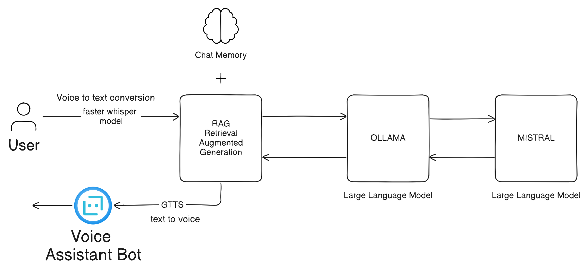

# RAG AI Voice Assistant



## Overview

The RAG AI Voice Assistant is a comprehensive system designed to interact with users through spoken commands and questions. It leverages various components to provide a seamless user experience:

- **User**: Interacts with the voice assistant by providing spoken instructions or questions.
- **Voice to Text Conversion**: Converts the user's speech into text for computer processing.
- **Faster Whisper Model**: Recognizes speech using the Faster Whisper model.
- **OLLAMA & MISTRAL**: Large language models (LLMs) used for processing user queries and generating responses.
- **RAG Retrieval Augmented Generation**: Combines information from conversation history and the internet to generate responses.
- **Chat Memory**: Stores past conversations with the user.
- **Text to Voice Conversion**: Converts generated text responses back into speech.
- **Voice Assistant Bot**: Integrates all components to enable voice-based interaction.

## Components

### Memory Buffer

Provides fast retrieval of data for quick access.

```python
# Example code for memory buffer usage
memory_buffer = MemoryBuffer()
data = memory_buffer.retrieve_data(key)
```

### Huge Data Storage

Utilizes a vector database for efficient storage and retrieval of large datasets.

```python
# Example code for vector database usage
vector_db = VectorDatabase()
vector_db.store_vectors(vectors)
results = vector_db.search(query_vector)
```

### Models

#### Faster Whisper

An implementation of a model for speech recognition.

```python
# Example code for Faster Whisper model usage
faster_whisper = FasterWhisperModel()
transcription = faster_whisper.transcribe(audio)
```

#### Mistral

An implementation of a model for natural language understanding and generation.

```python
# Example code for Mistral model usage
mistral = MistralModel()
response = mistral.generate_response(query)
```

## Qdrant

Qdrant is a vector search engine designed for similarity search, nearest neighbor search, and clustering of high-dimensional data.

### Docker Installation

To use Qdrant, pull the Docker image and run it as a container:

```bash
docker pull qdrant/qdrant
docker run -p 6333:6333 qdrant/qdrant
```

For detailed instructions, visit the [Qdrant website](https://qdrant.tech/).

## Usage

1. **Memory Buffer**: Utilize the memory buffer for fast data retrieval.
2. **Huge Data Storage**: Store and retrieve large datasets efficiently using the vector database.
3. **Models**: Use Faster Whisper for speech recognition and Mistral for natural language processing.

## Contributing

Contributions are welcome! Feel free to submit pull requests or open issues for any improvements or suggestions.
